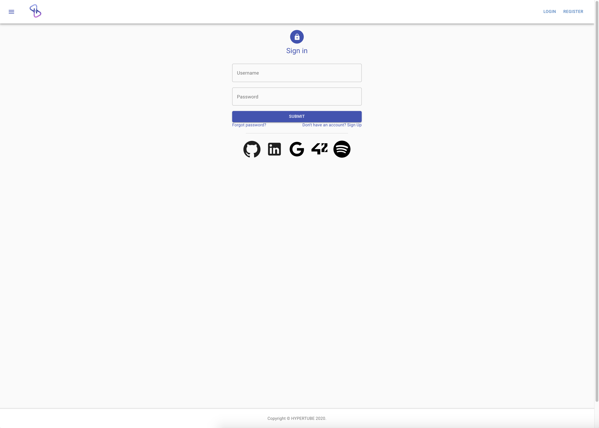

                         WELCOME TO OUR LOCAL VERSION OF Netflix
                         

> # Hypertube
Web Application for searching and streaming films - 1337 school (42 network) project.

> # Description
The aim of this application is to search and watch recents films with subtitles.

Users have access to the whole website after creating their account, 
they can do it either by the normal way or via Oauth with the following website:
- 42
- Google
- Github
- Linkedin
- Spotify

The users have the possibility watch films with several qualities and they can choise 
the language of the subtitle they want
They can also comment their favourite films, no to mention that the application save the history of these films
to rewatch later

The page of the streaming film contain also a bunch of similiar films.

> # Back-end
- Node.js
- Express.js
- MYSQL

> # Front-end
- React.js (+hooks)
- Redux (+ Redux form, Redux-saga)
- Material-ui

> # How to run it ?
    cd client && npm install

    cd server && npm install

    cd server/config && and sh index.sh //to launch db migration

    cd server && npm run dev

    cd client && serve -s build -l [PORT]

># Screenshots
* Login

* Home

* Profile

* Movie page

* Chat

> # Created By : 
-  SIFFEDINE Ilyas
-  GOULMANE Mouad
-  ELMAKHLOUK Chouaib 
-  BOUROUMANA Ismail
